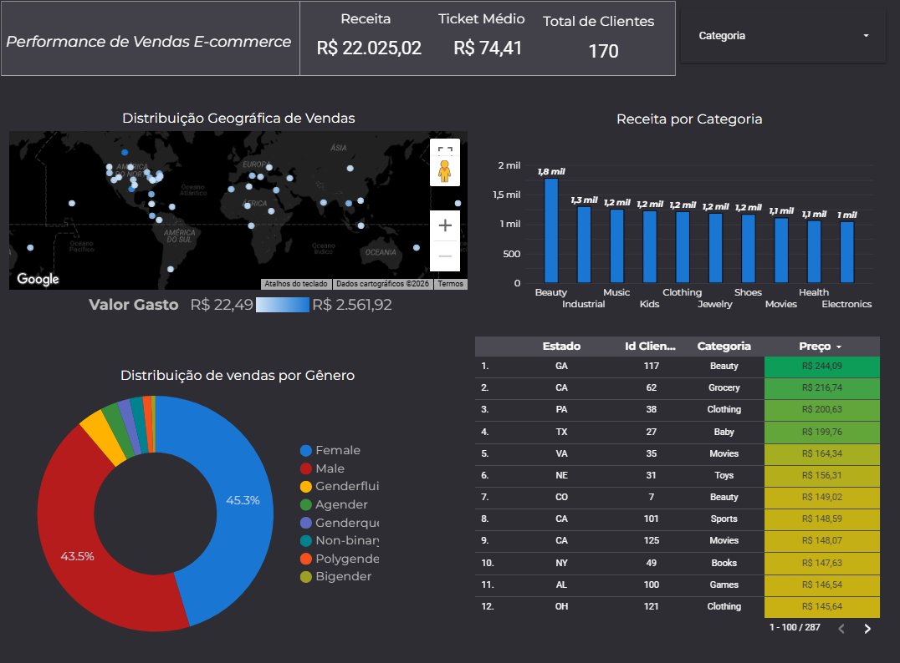

E-commerce Analysis: Do Jupyter Notebook ao Dashboard Interativo 📊

Este projeto demonstra o ciclo completo de um analista de dados: desde o tratamento e exploração de dados brutos utilizando Python (Jupyter Notebook) até à criação de um dashboard de Business Intelligence no Looker Studio para suporte à decisão executiva.

🎯 Objetivo do Projeto
Analisar a performance de vendas de uma operação global de e-commerce, identificando padrões de consumo por categoria, género e localização geográfica, além de monitorizar métricas críticas de rentabilidade.

📂 Estrutura do Repositório
/notebooks: Contém o ficheiro .ipynb com toda a limpeza, tratamento de dados (ETL) e análise exploratória (EDA).

/data: Base de dados utilizada (em formato CSV/Excel).

/images: Capturas de ecrã do dashboard final.

🛠️ Tecnologias Utilizadas
Python / Jupyter Notebook: Para manipulação de dados, tratamento de valores nulos e validação de métricas.

Looker Studio (Google): Para a visualização de dados e criação de dashboards interativos.

Google Maps API: Implementação de mapas de calor para análise geoespacial.

💡 Etapas de Desenvolvimento
1. Processamento e Limpeza (Python)
No notebook incluído, realizei as seguintes etapas:

Conversão de tipos de dados (Datas e Moedas).

Tratamento de campos técnicos para termos de negócio (ex: state_name para Estado).

Cálculo prévio de métricas como Ticket Médio para validação do dashboard.

2. Dashboard de BI (Looker Studio)
O relatório final foi desenhado com foco em UI/UX (Dark Mode) para facilitar a leitura e destaque de indicadores:

KPIs Principais: Receita Total, Ticket Médio e Volume de Clientes.

Geographic Intelligence: Mapa global interativo com densidade de faturamento.

Análise de Performance: Gráfico de barras com as categorias de maior destaque (Top Revenue).

Segmentação por Género: Distribuição percentual das vendas por perfil demográfico.

🚀 Destaques do Dashboard
Formatação Condicional Avançada: Implementação de escala de cores (gradiente) na tabela de vendas para destacar automaticamente transações de alto valor.

Interatividade: Filtros dinâmicos por categoria que atualizam todos os gráficos em tempo real.

Design Profissional: Layout otimizado para apresentações executivas, eliminando ruídos visuais e focando no que é acionável.

📊 Resultados Obtidos
Receita Analisada: R$ 22.025,02.

Ticket Médio: R$ 74,41.

Principais Categorias: Beauty, Industrial e Music.

📸 Pré-visualização do Projeto
(Dica: Substitui o link abaixo pelo caminho da imagem que subires na pasta /images)
